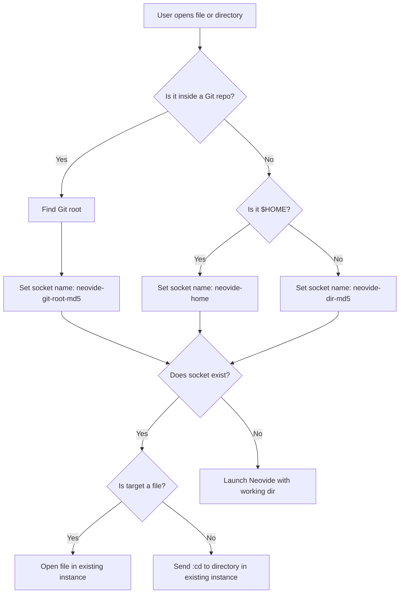

# NeovideProject

A macOS application that manages Neovide instances per Git repository, providing a seamless project-based editing experience.


As you can see in the screencast included, this can be used in association with any of several [Raycast](https://www.raycast.com/) extensions, or any other workflow management tool that can call `open`. My favorite is in combination with [Zoxide Git Projects](https://www.raycast.com/theherk/zoxide-git-projects), with which you can easily fuzzy find from all previously opened git projects.

🎥 View a longer [Introductory video in the wiki](https://github.com/theherk/NeovideProject/wiki/Usage).

## Features

- Single instance per Git repository
- Seamless switching between instances
- File/directory dropping support

## Requirements

- macOS 10.15 or later
- Neovide
- Neovim
- Git

## Installation

1. Download the latest release from the Releases page.
2. Move NeovideProject.app to your Applications folder.
3. (Optional) Set as default application for opening directories.

## Building from Source

1. Clone the repository:
   ```bash
   git clone https://github.com/theherk/NeovideProject
   ```

2. Run the build script:
   ```bash
   ./build.sh
   ```

3. The built application will be in `build/NeovideProject.app`

## Usage

- Drag and drop folders or files onto the application.
- Use "Open With" in Finder.
- Double-click Git repositories to open them in Neovide.

## Detailed Behavior

### Instance: Neovide or Neovim?

- **In the script, "instance" refers to a Neovim process launched by Neovide,** with each instance associated with a unique socket (named by git repo root, home, or directory).
- **Neovide** is the GUI frontend, but the script manages Neovim instances via sockets. Neovide connects to these Neovim instances.
- **Multiple Neovim instances:** One can have multiple Neovim instances (each with its own socket) running under Neovide, but the script enforces one instance per git repo (or directory/home).
- **RAM usage:** Heavy RAM usage typically comes from LSPs loaded by Neovim, not Neovide itself.

This can be a bit cumbersome with switching windows, since switching to the "Application" Neovide, does not switch consistently to the last selected instance and the window switcher list gets many instances. The former I actually just don't understand, and I think it is a MacOS peculiarity, but I'd love to find a way around it. The latter I simply do not worry about, because I always switch to precisely the project I seek directly.

### "Single instance per Git repository", What does it mean?

- **If you open a directory that is a git repo:**
  The script finds the git root and creates a socket named for that repo. If no Neovim instance exists for that socket, it launches Neovide (which launches Neovim) with that repo as the working directory.
- **If you open a file within that repo:**
  The script will connect to the existing Neovim instance for that repo (via the socket) and open the file as a buffer/tab.
- **If you open a subdirectory of the repo:**
  - If the subdirectory is inside the git repo, the script will still resolve the git root and use the same socket.
  - If the Neovim instance is already running, it will focus the existing Neovide window and (if you opened a directory) send a `:cd` command to change the working directory, or (if you opened a file) open the file.

### What does NeovideProject actually do with directories, git repos, and Neovide?

- **Project boundary detection:**
  Uses git root as the boundary for a "project." If no git repo, falls back to directory or home.
- **Instance management:**
  Ensures only one Neovim instance per project boundary (git repo, directory, or home).
- **Socket management:**
  Names sockets by project boundary, so opening anything within the same boundary connects to the same instance.
- **No Session restoration:**
  The script itself does **not** manage sessions or workspaces. It only launches/focuses Neovide/Neovim instances.
  **If you use a sessions plugin in Neovim, it will still work as expected**—the script does not interfere with session restoration.

### Relevance of zoxide, raycast, fzf, etc.

- These are just examples of good UX for quickly opening projects/files.
- **They are not dependencies** of NeovideProject.
- You can use them alongside NeovideProject for navigation, but NeovideProject itself is agnostic to these tools.

### Summary

| Action                    | What NeovideProject Does                     | What It Does NOT Do                     |
| ------------------------- | -------------------------------------------- | --------------------------------------- |
| Open git repo dir         | Launch/focus Neovide/Neovim for that repo    | Restore sessions/workspaces             |
| Open file in git repo     | Open file in existing instance for that repo | Manage buffers/tabs beyond opening file |
| Open subdir in git repo   | Focus instance, send `:cd` to subdir         | Open netrw or do nothing                |
| Open dir outside git repo | Launch/focus instance for that dir           | Session management                      |
| Use session plugin        | Unaffected—plugin manages session restore    |                                         |
| Use zoxide/raycast/fzf    | Unaffected—can use for navigation            |                                         |

### Instance Management Flow



## License

MIT License - See LICENSE file for details
